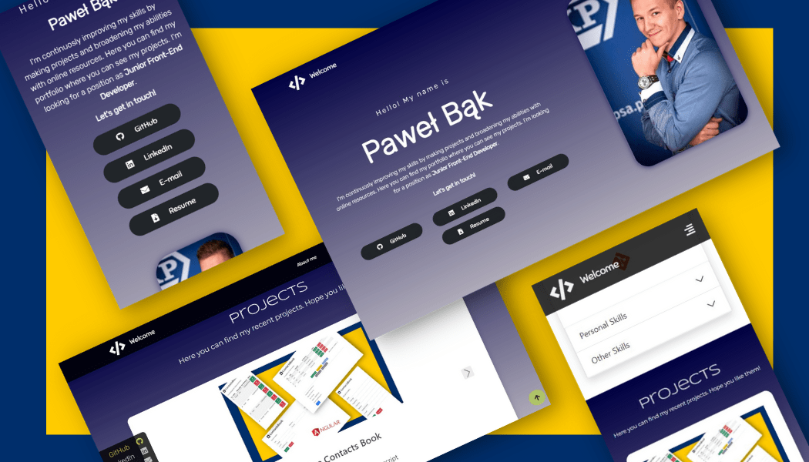

# Portfolio - My portfolio page

##### Created with Bootstrap, JQuery, HTML , CSS, Icons8, FontAwesome and AOS.

## Introduction

Fully responsive portfolio landing page, where you have easy access to my latest projects. You can find there my resume and ways to contact me. 
Page was created with bootstrap, and use [AOS](https://michalsnik.github.io/aos/) library to create smooth animations on scroll. I  also used standard logo icons from to [Icons8](https://icons8.com/) represent technologies that I know and skills that I have. 
Page contains icons from [Font Awesome ](https://fontawesome.com/)library too. 

## Built with

Project is created with:

- [Bootstrap 5.0](https://getbootstrap.com/)
- JQuery
- [Icons8](https://icons8.com/)
- [Font Awesome ](https://fontawesome.com/)
- [AOS](https://michalsnik.github.io/aos/)

## Features

- fully responsive landing page
- animations created with AOS library
- components like carousel, cards, and accordion
- categorized skills represented in a form of accordion
- projects represented as carousel with cards
- "go to top" and "go to section" created with JQuery
- ensuring a constant height of carousel with JQuery
- side toolbar appearing when you leave the welcome section, and disappering when you go back to the top
- reduced animations on mobiles
- hamburger menu on mobiles

## Screenshots

## Launch

### Live Demo

You can see deployed live demo [_here_](https://pawel-bak-portfolio.web.app/)

### Development server

Clone this repo to your desktop and open`index.html` in your browser.

## To-do

- short projects description

## Contact

Created by [@PawelBak](https://pawel-bak-portfolio.web.app/) - feel free to contact me!
